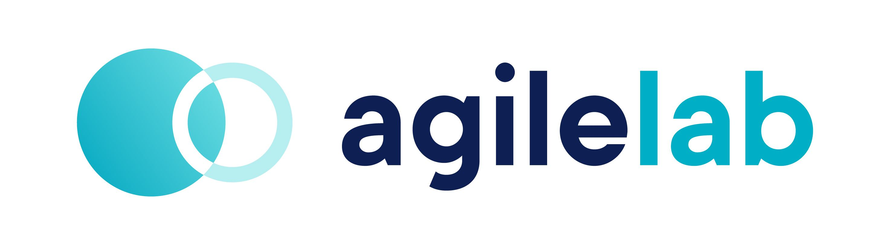

    

Designed by [Agile Lab](https://www.agilelab.it/), witboost is a versatile platform that addresses a wide range of sophisticated data engineering challenges. It enables businesses to discover, enhance, and productize their data, fostering the creation of automated data platforms that adhere to the highest standards of data governance. Want to know more about witboost? Check it out [here](https://www.agilelab.it/witboost) or [contact us!](https://www.agilelab.it/contacts)

This repository is part of our [Starter Kit](https://github.com/agile-lab-dev/witboost-starter-kit) meant to showcase witboost's integration capabilities and provide a "batteries-included" product.

# MWAA Workload Template

- [Overview](#overview)
- [Usage](#usage)

# Overview

Use this template to automatically create a DAG in an Amazon MWAA (Managed Workflows for Apache Airflow) instance which helps in orchestrating the data flow through various other components. The component from this template must be created last since it will depend on some components that had already been created.

Refer to the [witboost Starter Kit repository](https://github.com/agile-lab-dev/witboost-starter-kit) for information on the Specific Provisioner that can be used to deploy components created with this template.

### What's a Template?

A Template is a tool that helps create components inside a Data Mesh. Templates help establish a standard across the organization. This standard leads to easier understanding, management and maintenance of components. Templates provide a predefined structure so that developers don't have to start from scratch each time, which leads to faster development and allows them to focus on other aspects, such as testing and business logic.

For more information, please refer to the [official documentation](https://docs.witboost.agilelab.it/docs/p1_user/p6_advanced/p6_1_templates/#getting-started).

### What's a Workload?

Workload refers to any data processing step (ETL, job, transformation etc.) that is applied to data in a Data Product. Workloads can pull data from sources external to the Data Mesh or from an Output Port of a different Data Product or from Storage Areas inside the same Data Product, and persist it for further processing or serving.

### MWAA

Amazon Managed Workflows for Apache Airflow (MWAA) is an AWS service that allows users to orchestrate their workflows using Airflow Directed Acyclic Graphs (DAGs) written in Python without having to manage the Airflow infrastructure themselves.

Key features of Amazon MWAA include:

- Managed Service: Amazon MWAA manages the work involved in setting up Airflow, from provisioning the infrastructure capacity (server instances and storage) to installing the software and providing simplified user management and authorization through AWS Identity and Access Management (IAM) and Single Sign-On (SSO).
- Integration with AWS Services: Amazon MWAA is a workflow environment that allows data engineers and data scientists to build workflows using other AWS, on-premise, and other cloud services. Workflows in Amazon MWAA can interact with various AWS services like S3, EMR, Athena, SageMaker, etc.
- Security: Amazon MWAA uses AWS KMS to ensure your data is secure at rest. By default, Amazon MWAA uses AWS managed AWS KMS keys, but you can configure your environment to use your own customer-managed AWS KMS key.
- Autoscaling: Amazon MWAA configures an environment to run hundreds of tasks in parallel and workers concurrently. As tasks are queued, Amazon MWAA adds workers to meet demand, up to and until it reaches the number you define in Maximum worker count. This autoscaling mechanism will continue running the additional workers, until there are no more tasks to run. When there are no more tasks running, or tasks in the queue, Amazon MWAA disposes of the workers and scales back down to a single worker.

Learn more about it on the [official website](https://aws.amazon.com/managed-workflows-for-apache-airflow/).

# Usage

To get information on how to use this template, refer to this [document](./docs/index.md).

### Component Testing

To verify the component before deploying it along with the Data Product, the component needs to be tested against a CUE Policy defined for a [MWAA Workload](./policies/mwaa.cue). This policy needs to be defined inside the **Governance** section of the Witboost Platform.

For more information, please refer to the [official documentation](https://docs.witboost.agilelab.it/docs/p1_user/p5_managing_policies/p5_1_overview).

## License

This project is available under the [Apache License, Version 2.0](https://opensource.org/licenses/Apache-2.0); see [LICENSE](LICENSE) for full details.

## About us

    

Agile Lab creates value for its Clients in data-intensive environments through customizable solutions to establish performance driven processes, sustainable architectures, and automated platforms driven by data governance best practices.

Since 2014 we have implemented 100+ successful Elite Data Engineering initiatives and used that experience to create Witboost: a technology-agnostic, modular platform, that empowers modern enterprises to discover, elevate and productize their data both in traditional environments and on fully compliant Data mesh architectures.

[Contact us](https://www.agilelab.it/contacts) or follow us on:
- [LinkedIn](https://www.linkedin.com/company/agile-lab/)
- [Instagram](https://www.instagram.com/agilelab_official/)
- [YouTube](https://www.youtube.com/channel/UCTWdhr7_4JmZIpZFhMdLzAA)
- [Twitter](https://twitter.com/agile__lab)