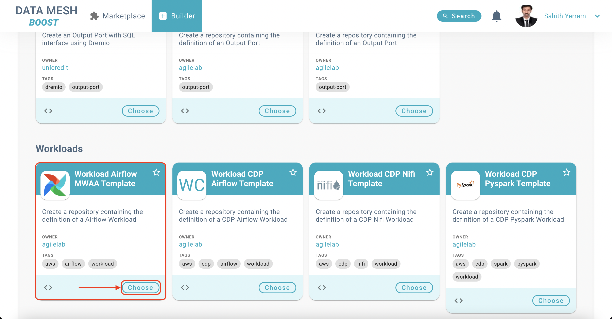
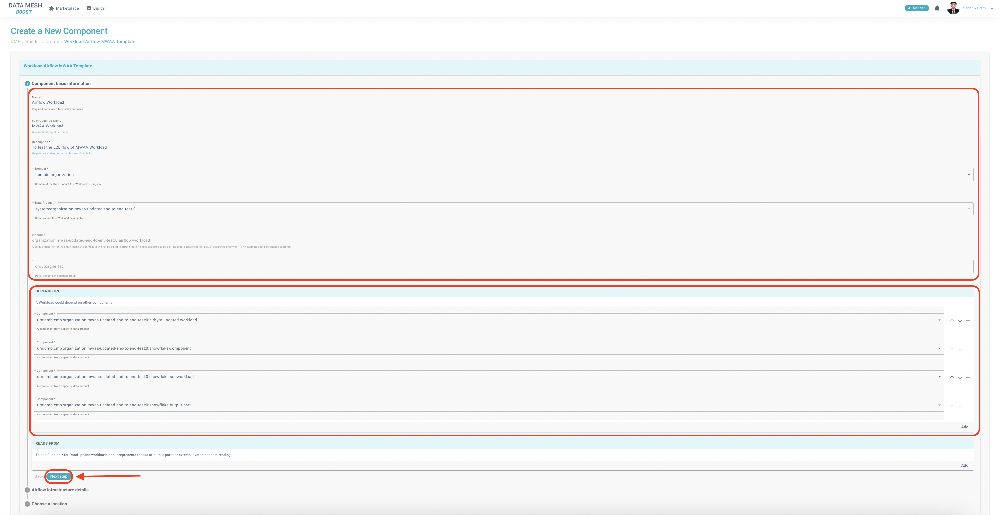
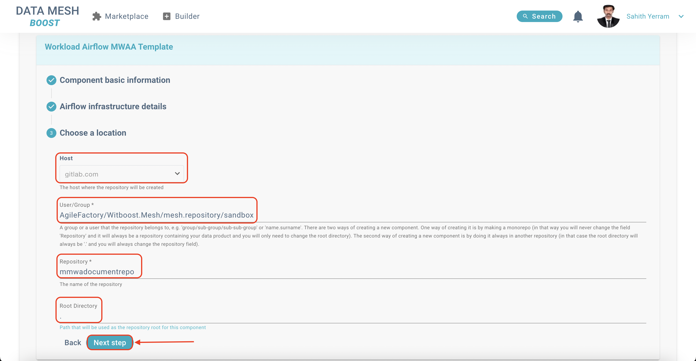
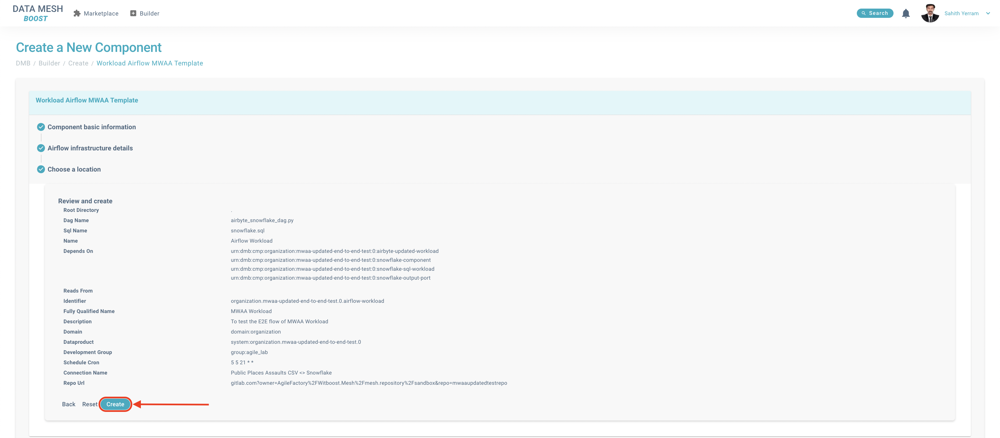
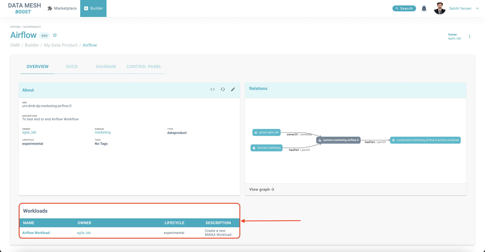
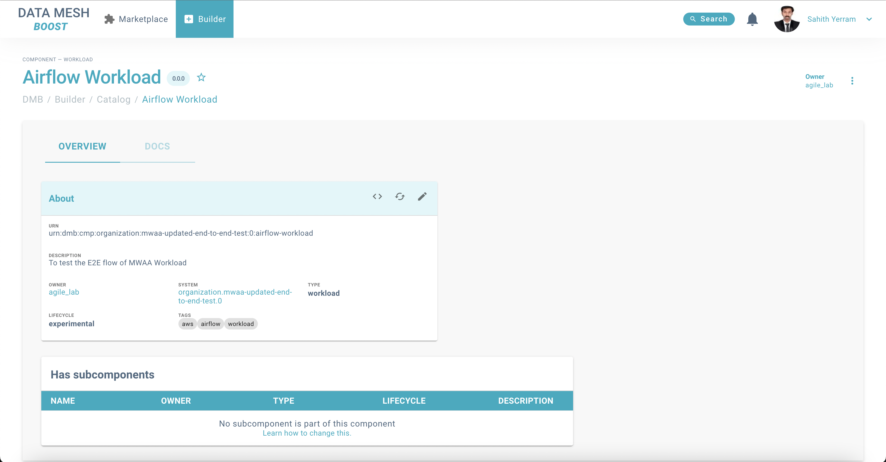

# MWAA workload for our Data Product

MWAA is in the center of the Data Product. It will orchestrate the flow of data along the different components, this is the last component that must be added since it will depend on several components that should have previously been created.

The following are the steps that we need to follow in order to work with MWAA workload.

## Creating a MWAA Workload

### Prerequisites

A Data Product should already exist in order to attach the new components to it.
The components **[Airbyte Workload](Airbyte_Component.md)**, **[Snowflake Output Port](SnowflakeOutputPort_Component.md)**, **[Snowflake SQL Workload]()** and **[Snowflake Storage]()** should exist in the Data Product.

1. To create this workload, we go again to the Builder and in the **Create** section, we choose the MWAA Workload by going into Workloads subsection of the "Create" section and then select **"Workload Airflow MWAA Template"** from the available options.

   

2. After clicking **"Choose"** button, we will be directed "Create a New Component" page. There are 3 sections within this page:

   ### 1. Component Basic Information

      In this section, you are expected to fill in some details which will be essential in order to create the workflow.

      - Name: Name which is used for display purposes. Default Name is provided if you don't have any idea what to fill in the first place (Required).
      - Fully Qualified Name: Human-readable name that identifies the Fully Qualified Name (Optional).
      - Description: Detailed information as to why this workload is created in first place and what is its intended usage (Required).
      - Domain: Select the Domain of the Data Product for which this workload is getting associated (Required).
      - Data Product: Select the appropriate Data Product for which this workload is getting associated (Required).
      - Identifier: A unique **uneditable** identifier for the entity inside the domain. It is expected to be a sequence of [a-zA-Z] letters separated by any of [-_] symbols (Required).
      - Data Product Development Group: This will be the group of developers who possess access to the Data Product Repositories. Since we are selecting the Data Product to which this workload will be associated, the appropriate value will be prefilled which is uneditable (Required).
      - Depends On: If you want your workload to depend on other components from a Data Product, you can choose this option.
        > In the case of the MWAA operator, you should add here the **Snowflake Output Port, the Airbyte Component and the SQL Workload Componen**t present on the Data Product in order for the orchestrator to execute only when these components are in place
   
      After filling in all fields with appropriate fields, your page should look like the one shown below. Click on the **"Next Step"** button to move to next section.

      

   ### 2. Airflow Infrastructure Details

      In this section, you are expected to fill in details pertaining to Airflow.

      - Cron expression defining schedule: Time (UTC) at which the Job will trigger (Required).
      - Dag File Name: Name of the Dag File (Required).
      - Name of the Snowflake SQL File: Name of the Snowflake SQL file that which would be put in the destination bucket (Required).
      - Name of the Airbyte Connection: Insert the name of the Airbyte connection you created (Required).
      
      After filling in all fields with appropriate fields, your page should look like the one shown below. Click on the **"Next Step"** button to move to next section.

      

   ### 3. Choose a Location
      In this section, you are expected to fill in details pertaining to the location of the Workload.

      - Host: The host where the repository will be created. By default, is `gitlab.com` (Required).
      - User / Group: A group or a user that the repository belongs to, e.g. 'group/sub-group/sub-sub-group' or 'name.surname'. There are two ways of creating a new component. One way of creating it is by making a monorepo (in that way you will never change the field 'Repository' and it will always be a repository containing your data product, and you will only need to change the root directory). The second way of creating a new component is by doing it always in another repository (in that case the root directory will always be '.' and you will always change the repository field) (Required).
      - Repository: Name of the repository (Required).
      - Root Directory: Path that will be used as the repository root for this Data Product. By default, the value would be **"."**.
      
      After filling in all fields with appropriate fields, your page should look like the one shown below. Click on the **"Next Step"** button to move to next section.

      

3. In the **"Review and Create"** section, all the previously filled data would be present through which we can cross-check the information once again. If you are satisfied, then proceed to create a Data Product by clicking on **"Create"** button present in the bottom-right of the section. Otherwise, you can go back to the previous sections by clicking on **"Back"** button.

    

    After clicking on "Create" button, the process of creating a Data Product will be initiated which would be done in 3 phases (Fetching Skeleton+Template, Publish and Register). If there aren't any errors in entering the information, all the 3 phases will be successful and will give you the links to the newly created Repository and the component in the Catalog.

4. After the previous steps are completed, Workload is created and attached to the corresponding Data Product in the **"Workloads"** section which is shown below:

    

5. When you click on the name of the workload, you would be able to see the details of the workload that is created.

    
<<<<<<< HEAD
=======

Now that we have added all necessary components to the Data Product, we can move on [deploying the Data Product](Deploy_Data_Product.md).
>>>>>>> Aligned docs with Installation
