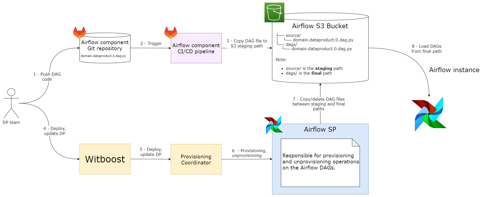

    

Designed by [Agile Lab](https://www.agilelab.it/), Witboost is a versatile platform that addresses a wide range of sophisticated data engineering challenges. It enables businesses to discover, enhance, and productize their data, fostering the creation of automated data platforms that adhere to the highest standards of data governance. Want to know more about Witboost? Check it out [here](https://www.agilelab.it/witboost) or [contact us!](https://www.agilelab.it/contacts)

This repository is part of our [Starter Kit](https://github.com/agile-lab-dev/witboost-starter-kit) meant to showcase Witboost's integration capabilities and provide a "batteries-included" product.

# MWAA Workload Template

- [Overview](#overview)
- [Usage](#usage)

# Overview

Use this template to automatically create a DAG in an Apache Airflow instance which helps in orchestrating the data flow through various other components. This DAG is uploaded to an object storage (the current provided implementation is based on [AWS S3 Storage](https://aws.amazon.com/s3/)) from which the Airflow instance can retrieve it.

The component from this template must be created last since it will depend on some components that had already been created.

Refer to the [Witboost Starter Kit repository](https://github.com/agile-lab-dev/witboost-starter-kit) for information on the Tech Adapter that can be used to deploy components created with this template.

### What's a Template?

A Template is a tool that helps create components inside a Data Mesh. Templates help establish a standard across the organization. This standard leads to easier understanding, management and maintenance of components. Templates provide a predefined structure so that developers don't have to start from scratch each time, which leads to faster development and allows them to focus on other aspects, such as testing and business logic.

For more information, please refer to the [official documentation](https://docs.witboost.agilelab.it/docs/p1_user/p6_advanced/p6_1_templates/#getting-started).

#### Skeleton Entities

Introduced in **Witboost 2.3**, Skeleton Entities provide a more dynamic and user-friendly approach to define systems and components. They seamlessly integrate with tools like the Editor Wizard and the Reverse Provisioning Wizard, allowing for easier entity management.

For more information, please refer to the [official documentation](https://docs.witboost.com/docs/p3_tech/p12_catalog/p12_2_skeleton_entities).

The template uses this new feature. The old version of the template, that generates instead [Legacy Entities](https://docs.witboost.com/docs/p3_tech/p12_catalog/p12_2_skeleton_entities/#skeleton-vs-legacy-entities), can be found in this same repository in the branch `release/v1`.

### What's a Workload?

Workload refers to any data processing step (ETL, job, transformation etc.) that is applied to data in a Data Product. Workloads can pull data from sources external to the Data Mesh or from an Output Port of a different Data Product or from Storage Areas inside the same Data Product, and persist it for further processing or serving.

### Apache Airflow

Apache Airflow is an open-source platform for developing, scheduling, and monitoring batch-oriented workflows. Airflow’s extensible Python framework enables you to build workflows connecting with virtually any technology. A web interface helps manage the state of your workflows. Airflow is deployable in many ways, varying from a single process on your laptop to a distributed setup to support even the biggest workflows.

The main characteristic of Airflow workflows is that all workflows are defined in Python code. “Workflows as code” serves several purposes:

- Dynamic: Airflow pipelines are configured as Python code, allowing for dynamic pipeline generation.
- Extensible: The Airflow framework contains operators to connect with numerous technologies. All Airflow components are extensible to easily adjust to your environment.
- Flexible: Workflow parameterization is built-in leveraging the Jinja templating engine.

Learn more about it on the [official website](https://airflow.apache.org/).

# Usage

To get information on how to use this template, refer to this [document](./docs/index.md).

### Component Testing

To verify the component before deploying it along with the Data Product, the component needs to be tested against a CUE Policy defined for a [Airflow Workload](./policies/airflow.cue). This policy needs to be defined inside the **Governance** section of the Witboost Platform.

For more information, please refer to the [official documentation](https://docs.witboost.agilelab.it/docs/p1_user/p5_managing_policies/p5_1_overview).

## License

This project is available under the [Apache License, Version 2.0](https://opensource.org/licenses/Apache-2.0); see [LICENSE](LICENSE) for full details.

## About Witboost

[Witboost](https://witboost.com/) is a cutting-edge Data Experience platform, that streamlines complex data projects across various platforms, enabling seamless data production and consumption. This unified approach empowers you to fully utilize your data without platform-specific hurdles, fostering smoother collaboration across teams.

It seamlessly blends business-relevant information, data governance processes, and IT delivery, ensuring technically sound data projects aligned with strategic objectives. Witboost facilitates data-driven decision-making while maintaining data security, ethics, and regulatory compliance.

Moreover, Witboost maximizes data potential through automation, freeing resources for strategic initiatives. Apply your data for growth, innovation and competitive advantage.

[Contact us](https://witboost.com/contact-us) or follow us on:

- [LinkedIn](https://www.linkedin.com/showcase/witboost/)
- [YouTube](https://www.youtube.com/@witboost-platform)